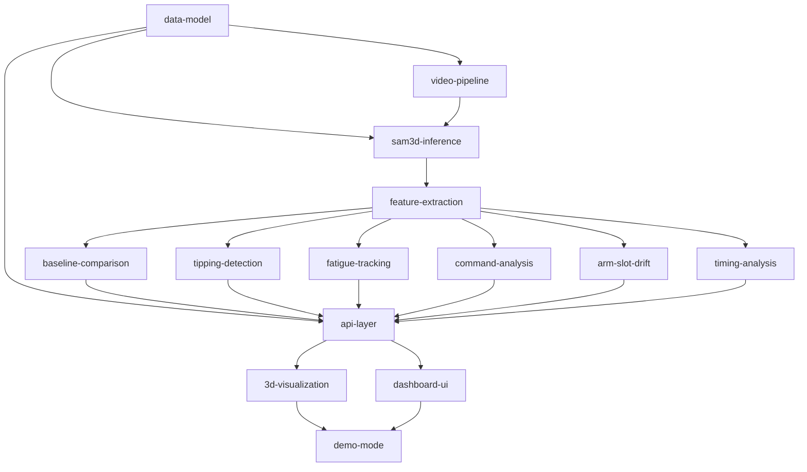

# Findings & Decisions

## 2026-04-07 Session — Trim Pipeline + SAM 3.1 Integration

### Strategic pivot
- App repositioned from "MLB player-dev tool with 9 analysis modules" to **"post-game tipping-confirmation tool"** targeting an MLB player-dev role.
- 4 modules deferred (preserved as `.py` files, unwired from API + reports): `injury_risk`, `fatigue_tracking`, `command_analysis`. Reasoning in `VALIDATION.md`.
- `tipping_detection` repositioned: now a post-game confirmation tool. Added `compare_within_outing()` as the new primary entry point.
- `historical_legends` spec deleted.
- Demo target locked: **Darvish 2017 WS G7 (game_pk 526517)** vs control **Darvish 2017-09-19 vs Phillies (game_pk 492355)**. Both fully downloadable from Savant.

### Pipeline reality findings
- **Broadcast cut after contact** (the #1 finding): per-pitch Savant clips for hit-into-play pitches show the broadcast cutting from pitcher cam to wide field shot ~5 seconds in. Visible in the in-play CH clip (b69a4fbd): pitcher visible frames 0-148, broadcast cut at frame 155, field action frames 155-300. The matplotlib joint inspection completely missed this — only the 2D-overlay video surfaced it. **Lesson: do a 2D-overlay spot check on at least one clip per pitch type per game.** The numerical .npz alone cannot tell you whether the model was tracking the pitcher or a fielder.
- **Pitch-outcome → broadcast behavior pattern**: `Ball`, `Called Strike`, `Swinging Strike`, `Foul` outcomes keep the camera on the pitcher for the full 10-second clip. `In play, *` outcomes cut to field action immediately on contact. The trim pipeline must handle both.
- **2017 broadcasts are 30fps/720p**, modern (2025+) clips are 60fps/1080p. Trim window framing must be FPS-aware: 5s = 150 frames @ 30fps, 5s = 300 frames @ 60fps.
- **`fetch_savant_clips.py --angle AWAY` returns no MP4 for 2017 postseason play_ids.** Savant only kept HOME-feed clips for older games. Workaround: pass `--angle HOME` explicitly. Permanent fix logged in TODOS — make the default fall back through HOME → CMS_NATIONAL → NETWORK → AWAY automatically.

### SAM 3.1 from mlx-vlm — verified working
- Installed `mlx-vlm 0.4.4` via `pip install --break-system-packages mlx-vlm` (project uses global Python). Pulled in transformers 5.5, mlx-lm 0.31, huggingface-hub 1.9, opencv 4.13.
- Model: `mlx-community/sam3.1-bf16` from HuggingFace. First-time download ~48s (1-2 GB). Cached at `~/.cache/huggingface/hub/models--mlx-community--sam3.1-bf16/`.
- Cold load into MLX: ~5s after first download.
- Inference speed: ~1000ms per call at default 1008px resolution on M3 Max.
- **SAM 3.1 supports text prompts** (correcting an earlier misconception). API: `predictor.predict(image, text_prompt="a baseball pitcher")` returns `.boxes`, `.masks`, `.scores`. The text grounding is the headline new feature vs. SAM 2.x.
- On the Darvish 2017 WS G7 frame, prompt "a person in a baseball uniform" returned 5 detections (scores 0.85, 0.80, 0.78, 0.72, 0.37) cleanly identifying pitcher, batter, catcher, umpire. Crowd in the stands was correctly excluded by the language grounding.

### SAM 3.1 pitcher tiebreaker — calibrated thresholds
SAM 3.1 returns ALL baseball-uniformed people in the frame. To pick the actual pitcher among catcher/batter/umpire/pitcher, the geometric tiebreaker uses these thresholds (calibrated against the Darvish 2017 frame):

| Constraint | Threshold | What it excludes |
|------------|-----------|------------------|
| `aspect_ratio >= 1.5` | tall vs square | crouching, sitting figures |
| `height_fraction >= 0.35` | bbox >= 35% of frame H | catcher, umpire, batter, far fielders |
| `height_fraction <= 0.85` | bbox <= 85% of frame H | closeups of glove or face |
| `center_y >= 0.55` | bbox center in lower 45% | batter (~0.43), umpire (~0.43), upper figures |
| `0.20 <= center_x <= 0.80` | not at edges | dugout figures, fans |
| **Tiebreaker** | largest area | when multiple candidates pass |

Empirically: previously loose thresholds (0.40 / 0.15) accepted batter, catcher, umpire, AND fielders. Tightened thresholds correctly select only Darvish across all sampled frames in the in-play CH clip.

### Trim pipeline architecture (Stage 1 of data pipeline)
- **Trimming runs at DOWNLOAD time, not inference time** — moved out of `batch_inference.py` and into the post-download step. No `--auto-trim` flag needed; trimming is unconditional.
- Algorithm uses two complementary signals:
  - **Phase 1: SAM 3.1 (semantic)** — early-exit forward scan to find the first frame where a pitcher is detected. Stride = 0.2s (FPS-aware). Min consecutive detections = 1 (strict geometric filter makes this safe). Stops as soon as the set frame is confirmed. Cost: ~3-7 SAM calls per clip = 3-7s.
  - **Phase 2: cv2 histogram diff (structural)** — scans `[set_frame, set_frame + 5s]` for the first scene cut. Catches the broadcast cut to field action. Cost: ~0.2s.
  - **Phase 3: combine** — `end_frame = min(set_frame + 5s, scene_cut, total_frames)`, `start_frame = max(0, set_frame - 0.5s)`.
- **Calibrated histogram threshold = 0.85** (NOT the literature default of 0.55). Pitcher-cam frames have inter-frame correlation 0.99-1.00. The actual broadcast cut in the Darvish clip dropped correlation to 0.649. 0.85 sits comfortably between. Lower threshold (0.55) FAILED to catch the cut.
- Total cost per clip: ~3-5s vs the previous uniform-sampling approach at 60s. **~12x speedup.**

### Mesh quality on 2017 broadcast footage — verified
- One Darvish CH pitch (b69a4fbd, 300 frames @ 30fps) ran end-to-end through SAM 3D Body MLX inference in 150.7s.
- Body bbox diagonal at frame 0 = **1.938m** (matches Darvish's 1.96m height).
- Body-center travel across all frames = **0.843m** (consistent with a pitcher's stride; far too much for a static catcher/umpire; far too small for model jitter onto random people).
- Visual frame extraction at frames 0/150/290 confirms a recognizable pitching delivery: standing → leg lift → follow-through.
- Mesh shape `(300, 18439, 3)`, joints shape `(300, 70, 3)`, no NaN/inf.

### Open issues from this session (must address in next session)
1. **Refactored delivery_window not yet re-tested with new thresholds** (`min_consecutive=1` and `_HIST_CORR_CUT_THRESHOLD=0.85`). Edited but not validated.
2. **fetch_savant_clips.py integration not yet done** (task #23). Trimmer is built but not wired into the download flow.
3. **mlx-vlm not yet pinned in requirements.txt** (task #19).
4. **Unit tests for delivery_window not written** (task #15).
5. **No end-to-end inference run on a trimmed clip yet** (task #21). Trim quality is visually verified but not tested through SAM 3D Body.
6. **GLB export tests broken (pre-existing)** — test_glb_export.py fails 2/2 tests due to uncommitted glb.py changes from before this session. Not blocking, but should be cleaned up.

---

## Goal
Build a web-based pitcher mechanics analyzer using SAM 3D Body to help MLB teams identify pitcher issues, packaged as a portfolio project for player development roles.

## Priority
Quality

## Mode
Spec-driven

## Approach
Next.js + FastAPI full-stack web app. SAM 3D Body (DINOv3-H+) for 3D reconstruction via SAM-Body4D. Six analysis modules. Three.js 3D mesh replay. Pre-computed demo mode for GPU-free presentations.

## Requirements
- Video-to-3D pipeline (bullpen, broadcast, phone, MiLB sources)
- Biomechanics analysis engine (all 6 modules: baseline, tipping, fatigue, command, arm slot, timing)
- Visual dashboard/GUI (Next.js + Three.js + Plotly)
- Pre-computed demo mode (works without GPU)

## Spec Map
-> Manifest: docs/plans/manifest.md
-> Specs directory: docs/plans/specs/

### Dependency DAG

### Per-Spec Decisions
| Spec | Key Decision | Rationale | Affects |
|------|-------------|-----------|---------|
| data-model | SQLite + Parquet hybrid | SQLite for queries, Parquet for numpy arrays (keeps DB lean) | all downstream specs |
| sam3d-inference | SAM-Body4D preferred, frame-by-frame fallback | SAM-Body4D handles temporal consistency natively | feature-extraction |
| tipping-detection | Random Forest + XGBoost with SHAP | Interpretable results matter more than marginal accuracy gains | api-layer, dashboard-ui |
| fatigue-tracking | BOCPD via ruptures library | Better than CUSUM for detecting gradual vs sudden changepoints | api-layer, dashboard-ui |
| api-layer | FastAPI with WebSocket for progress | Need real-time feedback during video processing | 3d-visualization, dashboard-ui |
| 3d-visualization | React Three Fiber (not raw Three.js) | React integration, component model, ecosystem | dashboard-ui |
| dashboard-ui | Next.js 14 + Tailwind + dark theme | Dark matches baseball broadcast rooms, modern stack | demo-mode |
| demo-mode | Docker Compose deployment | One command, no dependencies, portable | none |

## Sprint Grouping
| Sprint | Specs | Can Parallelize |
|--------|-------|-----------------|
| Phase 1, Sprint 1 | data-model | no |
| Phase 1, Sprint 2 | video-pipeline, sam3d-inference | yes |
| Phase 2, Sprint 1 | feature-extraction | no |
| Phase 2, Sprint 2 | baseline-comparison, tipping-detection, fatigue-tracking, command-analysis, arm-slot-drift, timing-analysis | yes (6-way) |
| Phase 3, Sprint 1 | api-layer | no |
| Phase 3, Sprint 2 | 3d-visualization, dashboard-ui | yes |
| Phase 4, Sprint 1 | demo-mode | no |

## Research Findings
- SAM 3D Body: 127 joints, 54.8mm MPJPE, DINOv3-H+ variant, CC BY-NC 4.0 license
- SAM-Body4D: training-free video extension, Kalman smoothing built in
- MHR decouples skeleton from surface — clean joint angle measurements
- KinaTrax is the industry standard (~25mm accuracy) but needs 8 cameras
- Driveline OpenBiomechanics: 100K+ pitches of motion capture data for validation
- PitcherNet (Waterloo/Orioles): comparable single-camera approach but uses SMPL (22 joints vs 127)
- Normative ranges documented: stride 77-87% height, hip-shoulder sep 35-60 deg, MER ~170 deg
- 27% of pitchers change arm slot by 5+ degrees year-over-year (FanGraphs)
- Fatigue-related mechanical breakdown: 36x surgery risk increase (ASMI)
- ~50% of mechanical flaws are correctable through targeted movement modification

## Technical Decisions
| Decision | Rationale |
|----------|-----------|
| SAM 3D Body over OpenPose/MediaPipe | 127 joints vs 25/33, full 3D mesh, hand/foot decoders for release point |
| Next.js over Streamlit | Looks like a product, not a prototype. MLB teams are used to polished vendor tools. |
| Three.js via React Three Fiber | Best browser 3D library, React integration via R3F |
| Plotly over Matplotlib | Interactive charts in browser, hover tooltips, zoom |
| Dark theme | Baseball video rooms are dim, matches broadcast aesthetic |
| Pre-computed demo mode | Can't rely on GPU in meeting rooms |
| All 6 analysis modules | Shows breadth of domain knowledge. Quality bar means each must work correctly. |
| Injury risk score | Composite risk indicator from fatigue + arm slot + timing. Call it "indicator" not "predictor" — honest framing matters. |
| Statcast correlation | Closes the loop from mechanics to outcomes. "Your slider doesn't slide because..." |
| Historical legends | Only possible with single-camera tools. KinaTrax didn't exist in 1995. Great demo conversation starter. |
| AI scouting reports | LLM-generated one-pagers in scout language. Bridges data to decisions. |
| Gemma 4 E4B for all LLM tasks | Local multimodal model via mlx-vlm. Zero API cost, data stays on machine, ~16GB fits alongside SAM 3D Body on 128GB M3 Max. Vision encoder (SigLIP2) lets it see rendered frames of the delivery. |
| Local-first query parsing | Gemma4 does NL→JSON extraction for the query parser (text-only, no vision). Anthropic Claude as cloud fallback only. |
| Provider-agnostic LLM interface | DiagnosticProvider ABC + ParserBackend ABC. Swap between Gemma4/Claude/OpenAI/Ollama with one argument. |
| War Room dashboard design | Dense 3-column layout (40% viewer / 35% report / 25% stats) with Lab Notebook spacing. JetBrains Mono for data, dark surfaces (#0a0a0a → #111 → #1a1a1a). Everything visible without scrolling at 1440p. |
| Progress token polling | When MLX inference needed for uncached pitches, return a token and poll. Keeps HTTP fast while GPU works. |

## Visual/Browser Findings
- War Room design direction approved (2026-04-05): dense, monospace data, dark theme, blue/orange accents
- Lab Notebook spacing borrowed: generous padding (16-20px), 1.7 line-height for report prose
- Mobile deferred — desktop-first tool for MLB analysts on 1440p+ monitors

## CEO Review Findings (2026-04-03)

### Vision Reframe
Original: upload bullpen video, study analysis after the fact.
New: live game companion (stream mode) + upload mode (batch analysis). Both first-class. Same analysis engine underneath.

### Starting Scope: Ohtani MVP
- Build complete mechanical analysis of Shohei Ohtani from YouTube broadcast footage + Statcast data
- Single pitcher, consistent camera angle (CF cam), 5-20 games
- Validate SAM 3D Body quality from broadcast footage before expanding

### Key Discoveries
- **Fast SAM 3D Body** (arXiv:2603.15603, March 2026): 10.9x speedup, ~65ms/frame on RTX 5090. Training-free. Makes real-time feasible.
- **SAM-Body4D** (arXiv:2512.08406): temporal consistency for video, occlusion-aware, multi-person. Core of video reconstruction.
- **SAM4Dcap** (arXiv:2602.13760): SAM-Body4D + OpenSim for biomechanics. Directly solves video → biomechanics.
- **SAM 3D Body on MPS** (validated 2026-04-03): PyTorch/MPS runs at 1.1 fps on M3 Max, 2.4x faster than MLX port with better mesh quality. Cloud GPU not needed for batch analysis.
- **fal.ai API**: SAM 3D Body at $0.02/image. Good for prototyping, expensive at scale. Less relevant now that local MPS works.
- **mlx-vlm**: SAM 3/3.1 segmentation runs on MLX. SAM 3D Body MLX port now fully functional after 3 bug fixes (~490ms/frame). Also used for Gemma 4 E4B multimodal diagnostic reports.
- **Driveline OpenBiomechanics**: 100K+ pitches of motion capture data. Validation reference (not direct input).

### Local MPS Validation (2026-04-03)
SAM 3D Body runs on M3 Max via PyTorch/MPS. Tested on 32s Ohtani broadcast clip (957 frames, 1280x720, MLB Network).

| Metric | PyTorch/MPS | MLX Port |
|--------|------------|----------|
| Median per frame | **748ms** | 1773ms |
| Throughput | **1.1 fps** | 0.5 fps |
| Total (957 frames) | **836s (~14 min)** | 1931s (~32 min) |
| Detection failures | — | 0/957 |

PyTorch/MPS is 2.4x faster with better mesh quality. Mesh tracks Ohtani accurately from broadcast camera angle; isolates target pitcher (ignores other people in frame). Output: `output/ohtani_full_mesh.mp4`, `output/ohtani_full_pytorch.mp4`. Script: `scripts/run_pytorch_video.py`.

Implication: **cloud GPU not required for batch analysis.** M3 Max handles the Ohtani MVP workload locally. Cloud GPU only needed for real-time/stream mode or SAM4Dcap biomechanics pipeline.

### Architecture Decisions
| Decision | Choice | Rationale |
|----------|--------|-----------|
| Joint abstraction | Direct MHR (no abstraction layer) | Simpler. Refactor when a second model is needed. |
| Pitcher detection | Statcast game log | No computer vision needed. Statcast records which pitcher threw each pitch. |
| Pitch matching | Cross-reference + sequence alignment | Velocity + type + timing first, DTW/Needleman-Wunsch fallback. |
| Inference hardware | Local MPS (batch) / Cloud GPU (stream) | M3 Max handles batch at 1.1 fps. Cloud only for real-time or SAM4Dcap. Updated 2026-04-04. |
| MLX port | **Complete — now default backend** | 3 bugs fixed (param_limits, scale, pose correctives). ~490ms/frame, vertices match PyTorch within 0.0001mm. Default in batch_inference.py. |
| LLM for diagnostics | Gemma 4 E4B local via mlx-vlm | Multimodal (vision+text), ~16GB, runs on M3 Max alongside SAM 3D Body. Provider-agnostic engine supports Claude API, Ollama, OpenAI-compat as fallbacks. |
| LLM fact-checking | Skip for MVP | Feed correct structured data to LLM, trust output. |
| Inference backend | Abstracted with factory pattern | create_inference("mlx") or create_inference("pytorch"). Backend-agnostic ABC in pipeline/inference.py. |
| Delivery comparison | Phase-normalized alignment | compare_deliveries() normalizes both pitches to 101 frames (wind-up/cocking/acceleration), diffs all biomechanical features, identifies most divergent moment. |

### Critical Gaps Identified
1. Broadcast pitch segmentation (replay false positives)
2. Wrong-person reconstruction (no verification)
3. NaN handling in feature extraction
4. Statcast pitch matching from broadcast footage with camera cuts

### Latency Budget (stream mode, future)
Total per pitch: ~7 seconds. Time between pitches: ~20-25 seconds. Feasible.

### Sources
- Fast SAM 3D Body: https://github.com/yangtiming/Fast-SAM-3D-Body
- SAM-Body4D: https://github.com/gaomingqi/sam-body4d
- SAM 3D Body: https://github.com/facebookresearch/sam-3d-body
- SAM4Dcap: https://arxiv.org/html/2602.13760
- fal.ai: https://fal.ai/models/fal-ai/sam-3/3d-body
- mlx-vlm: https://github.com/Blaizzy/mlx-vlm
- HuggingFace model: https://huggingface.co/facebook/sam-3d-body-dinov3
