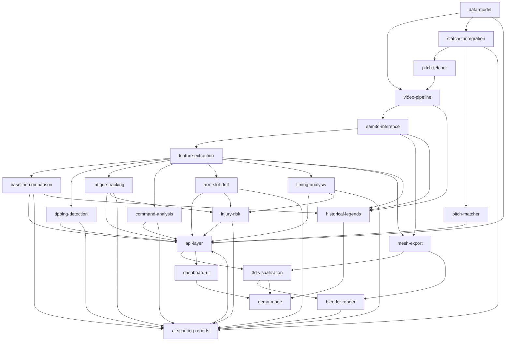

# SamPlaysBaseball — Project Manifest

**Project:** Pitcher Mechanics Analyzer
**Date:** 2026-04-04 (revised from 2026-02-16)
**Mode:** Spec-driven
**Priority:** Quality
**Stack:** Next.js + FastAPI + SAM 3D Body (PyTorch/MPS) + Three.js + Blender

## Goal

Build a tool that analyzes MLB pitcher mechanics from broadcast video. Two modes: batch analysis (upload/fetch clips) and live game companion (future). Per-pitch video clips from Baseball Savant feed into SAM 3D Body on Apple Silicon (M3 Max MPS), producing 3D mesh and skeleton data stored in SQLite + .npz. Six biomechanical analysis modules + injury risk + Statcast correlation produce insights surfaced through an interactive dashboard with 3D mesh replay. AI-generated scouting reports translate analysis into scout-readable language.

Starting scope: Shohei Ohtani from broadcast footage + Statcast data. Single pitcher, consistent camera angle, 5-20 games.

Target audience: MLB player development personnel. Portfolio/showcase project.

## Vision (CEO Review 2026-04-03)

- **Dual mode:** batch analysis (upload/Savant clips) + live game companion (stream, future)
- **Ohtani MVP first:** prove pipeline on one pitcher before expanding
- **Local inference:** M3 Max MPS at 1.1 fps (validated). Cloud GPU only for real-time/SAM4Dcap.
- **Data source:** Baseball Savant per-pitch clips (pre-segmented, Statcast-linked)

## Dependency Graph



## Phase / Sprint / Spec Map

| Phase | Sprint | Spec | Depends On | Status |
|-------|--------|------|------------|--------|
| 1 | 1 | data-model | — | needs-revision |
| 1 | 1 | statcast-integration | data-model | needs-revision |
| 1 | 1 | pitch-fetcher | statcast-integration | **implemented** |
| 1 | 2 | video-pipeline | data-model, pitch-fetcher | needs-revision |
| 1 | 2 | sam3d-inference | video-pipeline | needs-revision |
| 1 | 2 | pitch-matcher | statcast-integration | designed |
| 2 | 1 | feature-extraction | sam3d-inference | draft |
| 2 | 1 | mesh-export | sam3d-inference, feature-extraction | draft |
| 2 | 2 | baseline-comparison | feature-extraction | draft |
| 2 | 2 | tipping-detection | feature-extraction | draft |
| 2 | 2 | fatigue-tracking | feature-extraction | draft |
| 2 | 2 | command-analysis | feature-extraction | draft |
| 2 | 2 | arm-slot-drift | feature-extraction | draft |
| 2 | 2 | timing-analysis | feature-extraction | draft |
| 2 | 3 | injury-risk | fatigue, arm-slot, timing | draft |
| 3 | 1 | ai-scouting-reports | all analysis + injury-risk + statcast | draft |
| 3 | 1 | api-layer | data-model, all analysis, scouting | draft |
| 3 | 2 | 3d-visualization | api-layer, mesh-export | draft |
| 3 | 2 | dashboard-ui | api-layer | draft |
| 3 | 2 | blender-render | mesh-export, 3d-visualization | draft |
| 4 | 1 | historical-legends | pipeline + feature-extraction + baseline | draft |
| 4 | 1 | demo-mode | 3d-visualization, dashboard-ui | draft |

### MLX Port (separate track, lower priority)

| Phase | Sprint | Spec | Status |
|-------|--------|------|--------|
| MLX-1 | 1 | mlx-weight-converter | draft |
| MLX-1 | 2 | mlx-backbone | draft |
| MLX-2 | 1 | mlx-decoder | draft |
| MLX-2 | 2 | mlx-mhr-head | draft |
| MLX-3 | 1 | mlx-inference | draft |
| MLX-3 | 1 | mlx-validation | draft |

Note: MLX port is an optimization. PyTorch/MPS already runs 2.4x faster (1.1fps vs 0.5fps).

## Spec Files

| Spec | Path | Status | Notes |
|------|------|--------|-------|
| data-model | specs/data-model-spec.md | needs-revision | PitchRecord/MeshData added, PitchDB not in spec |
| video-pipeline | specs/video-pipeline-spec.md | needs-revision | Now uses Savant per-pitch clips, not FFmpeg frame extraction |
| sam3d-inference | specs/sam3d-inference-spec.md | needs-revision | Working script exists, spec doesn't match batch_inference.py |
| pitch-fetcher | — | **implemented** | scripts/fetch_savant_clips.py (no spec, built directly) |
| pitch-matcher | docs/plans/2026-04-04-pitch-matcher-design.md | designed | Tiered DTW design, blocked on pipeline output |
| feature-extraction | specs/feature-extraction-spec.md | draft | Next to implement |
| baseline-comparison | specs/baseline-comparison-spec.md | draft | |
| tipping-detection | specs/tipping-detection-spec.md | draft | |
| fatigue-tracking | specs/fatigue-tracking-spec.md | draft | |
| command-analysis | specs/command-analysis-spec.md | draft | |
| arm-slot-drift | specs/arm-slot-drift-spec.md | draft | |
| timing-analysis | specs/timing-analysis-spec.md | draft | |
| injury-risk | specs/injury-risk-spec.md | draft | |
| statcast-integration | specs/statcast-integration-spec.md | needs-revision | StatcastFetcher exists but PitchDB enrichment is new |
| mesh-export | specs/mesh-export-spec.md | draft | |
| api-layer | specs/api-layer-spec.md | draft | |
| 3d-visualization | specs/3d-visualization-spec.md | draft | |
| dashboard-ui | specs/dashboard-ui-spec.md | draft | |
| blender-render | specs/blender-render-spec.md | draft | |
| ai-scouting-reports | specs/ai-scouting-reports-spec.md | draft | |
| historical-legends | specs/historical-legends-spec.md | draft | |
| demo-mode | specs/demo-mode-spec.md | draft | |
| mlx-weight-converter | specs/mlx-weight-converter-spec.md | draft | |
| mlx-backbone | specs/mlx-backbone-spec.md | draft | |
| mlx-mhr-head | specs/mlx-mhr-head-spec.md | draft | |
| mlx-decoder | specs/mlx-decoder-spec.md | draft | |
| mlx-inference | specs/mlx-inference-spec.md | draft | |
| mlx-validation | specs/mlx-validation-spec.md | draft | |

## What Exists (implemented without specs or ahead of specs)

| Component | File(s) | Status |
|-----------|---------|--------|
| Pitch fetcher | scripts/fetch_savant_clips.py | working — downloads per-pitch clips via yt-dlp |
| Player search | backend/app/data/player_search.py | working — name search, game log, per-pitch lookup |
| Pitch database | backend/app/data/pitch_db.py | working — SQLite + .npz, Statcast enrichment |
| Batch inference | scripts/batch_inference.py | working — SAM 3D Body per clip, stores mesh/skeleton |
| SAM 3D Body runner | scripts/run_pytorch_video.py | working — PyTorch/MPS video inference |
| Statcast fetcher | backend/app/data/statcast.py | working — pybaseball + CSV + simple key matching |
| Correlation engine | backend/app/analysis/correlation.py | working — Pearson/Spearman + Ridge/LASSO |
| Data models | backend/app/models/pitch.py | working — PitchMetadata, PitchData |

## Project Structure (Actual)

```
SamPlaysBaseball/
├── backend/
│   ├── app/
│   │   ├── main.py              # FastAPI entry
│   │   ├── models/
│   │   │   └── pitch.py         # PitchMetadata, PitchData
│   │   ├── data/
│   │   │   ├── statcast.py      # StatcastFetcher (pybaseball + CSV)
│   │   │   ├── pitch_db.py      # PitchDB (SQLite + .npz storage)
│   │   │   └── player_search.py # MLB Stats API player search
│   │   ├── analysis/
│   │   │   └── correlation.py   # CorrelationEngine
│   │   ├── pipeline/            # (planned)
│   │   ├── export/              # (planned)
│   │   ├── reports/             # (planned)
│   │   └── api/                 # (planned)
│   ├── tests/
│   └── requirements.txt
├── scripts/
│   ├── run_pytorch_video.py     # SAM 3D Body PyTorch/MPS inference
│   ├── fetch_savant_clips.py    # Baseball Savant per-pitch clip downloader
│   ├── batch_inference.py       # Batch SAM 3D Body → mesh/skeleton storage
│   └── blender/                 # Blender render scripts
├── data/
│   ├── clips/{game_pk}/         # Downloaded per-pitch video clips
│   ├── meshes/{game_pk}/        # .npz mesh/skeleton files
│   └── pitches.db               # SQLite pitch database
├── input/                       # Raw input videos
├── output/                      # Inference output videos
├── frontend/                    # (planned)
├── docs/
│   └── plans/                   # Planning directory
└── CLAUDE.md
```
