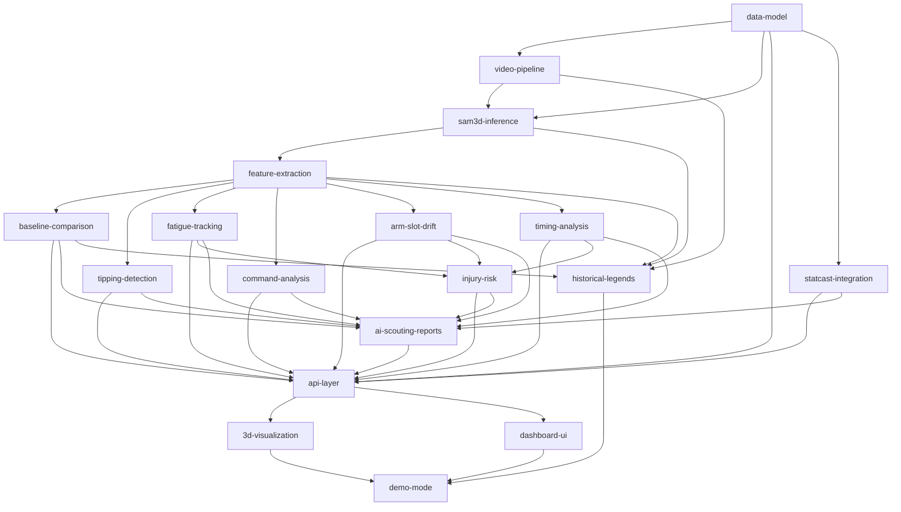

# SamPlaysBaseball — Project Manifest

**Project:** Pitcher Mechanics Analyzer
**Date:** 2026-02-16
**Mode:** Spec-driven
**Priority:** Quality
**Stack:** Next.js + FastAPI + SAM 3D Body (DINOv3-H+) + SAM-Body4D

## Goal

Build a web-based tool that ingests pitcher video from any source, reconstructs 3D body mechanics using Meta's SAM 3D Body model, runs eight analysis modules (6 biomechanics + injury risk + Statcast correlation), and displays results through an interactive dashboard with 3D mesh replay. AI-generated scouting reports translate analysis into scout-readable language. Historical legend comparisons and pre-computed demo mode ship with the repo for GPU-free presentations.

Target audience: MLB player development personnel. This is a portfolio/showcase project.

## Dependency Graph



## Phase / Sprint / Spec Map

| Phase | Sprint | Spec | Depends On | Parallelizable |
|-------|--------|------|------------|----------------|
| 1 | 1 | data-model | — | root |
| 1 | 2 | video-pipeline | data-model | yes (with sam3d-inference) |
| 1 | 2 | sam3d-inference | data-model, video-pipeline | yes (with video-pipeline) |
| 2 | 1 | feature-extraction | sam3d-inference | no |
| 2 | 2 | baseline-comparison | feature-extraction | yes (6-way parallel) |
| 2 | 2 | tipping-detection | feature-extraction | yes |
| 2 | 2 | fatigue-tracking | feature-extraction | yes |
| 2 | 2 | command-analysis | feature-extraction | yes |
| 2 | 2 | arm-slot-drift | feature-extraction | yes |
| 2 | 2 | timing-analysis | feature-extraction | yes |
| 2 | 1 | statcast-integration | data-model | yes (with feature-extraction) |
| 2 | 3 | injury-risk | fatigue, arm-slot, timing | no |
| 3 | 1 | ai-scouting-reports | all analysis + injury-risk + statcast | yes (with api-layer) |
| 3 | 1 | api-layer | data-model, all analysis specs, scouting | no |
| 3 | 2 | 3d-visualization | api-layer | yes (with dashboard-ui) |
| 3 | 2 | dashboard-ui | api-layer | yes (with 3d-visualization) |
| 4 | 1 | historical-legends | pipeline + feature-extraction + baseline | yes (with demo-mode) |
| 4 | 1 | demo-mode | 3d-visualization, dashboard-ui | no |

## Spec Files

| Spec | Path | Status |
|------|------|--------|
| data-model | specs/data-model-spec.md | draft |
| video-pipeline | specs/video-pipeline-spec.md | draft |
| sam3d-inference | specs/sam3d-inference-spec.md | draft |
| feature-extraction | specs/feature-extraction-spec.md | draft |
| baseline-comparison | specs/baseline-comparison-spec.md | draft |
| tipping-detection | specs/tipping-detection-spec.md | draft |
| fatigue-tracking | specs/fatigue-tracking-spec.md | draft |
| command-analysis | specs/command-analysis-spec.md | draft |
| arm-slot-drift | specs/arm-slot-drift-spec.md | draft |
| timing-analysis | specs/timing-analysis-spec.md | draft |
| api-layer | specs/api-layer-spec.md | draft |
| 3d-visualization | specs/3d-visualization-spec.md | draft |
| dashboard-ui | specs/dashboard-ui-spec.md | draft |
| demo-mode | specs/demo-mode-spec.md | draft |
| injury-risk | specs/injury-risk-spec.md | draft |
| statcast-integration | specs/statcast-integration-spec.md | draft |
| historical-legends | specs/historical-legends-spec.md | draft |
| ai-scouting-reports | specs/ai-scouting-reports-spec.md | draft |

## Project Structure (Target)

```
SamPlaysBaseball/
├── backend/
│   ├── app/
│   │   ├── main.py              # FastAPI entry
│   │   ├── models/              # Pydantic/dataclass models
│   │   ├── pipeline/            # Video + SAM3D + feature extraction
│   │   ├── analysis/            # 8 analysis modules + injury risk
│   │   ├── data/                # Statcast integration
│   │   ├── reports/             # AI scouting report generation
│   │   └── api/                 # Route handlers
│   ├── tests/
│   └── requirements.txt
├── frontend/
│   ├── src/
│   │   ├── app/                 # Next.js pages
│   │   ├── components/
│   │   │   ├── three/           # Three.js 3D visualization
│   │   │   ├── charts/          # Plotly chart components
│   │   │   └── ui/              # Shared UI components
│   │   └── lib/                 # API client, utilities
│   └── package.json
├── demo/
│   ├── data/                    # Pre-computed pitch data
│   ├── results/                 # Pre-computed analysis results
│   ├── legends/                 # Historical pitcher analysis
│   └── launcher.py              # Zero-GPU demo script
├── docs/
│   └── plans/                   # This planning directory
└── CLAUDE.md
```
