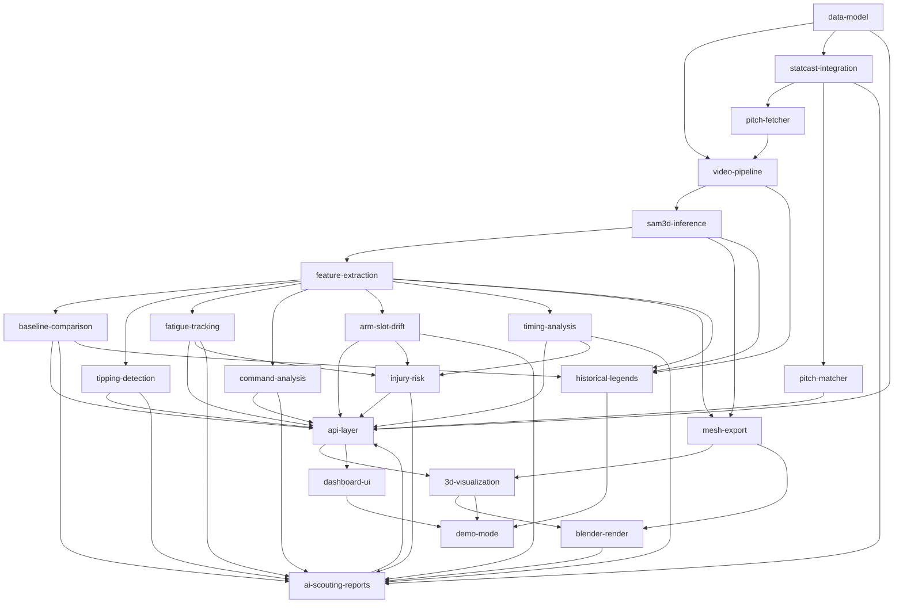

# SamPlaysBaseball — Project Manifest

**Project:** Pitcher Mechanics Analyzer
**Date:** 2026-04-05 (revised from 2026-04-04)
**Mode:** Spec-driven
**Priority:** Quality
**Stack:** Next.js + FastAPI + SAM 3D Body (MLX/PyTorch) + Three.js + Gemma 4 E4B (mlx-vlm)

## Goal

Build a tool that analyzes MLB pitcher mechanics from broadcast video. Two modes: batch analysis (upload/fetch clips) and live game companion (future). Per-pitch video clips from Baseball Savant feed into SAM 3D Body on Apple Silicon (M3 Max MPS), producing 3D mesh and skeleton data stored in SQLite + .npz. Six biomechanical analysis modules + injury risk + Statcast correlation produce insights surfaced through an interactive dashboard with 3D mesh replay. AI-generated scouting reports translate analysis into scout-readable language.

Starting scope: Shohei Ohtani from broadcast footage + Statcast data. Single pitcher, consistent camera angle, 5-20 games.

Target audience: MLB player development personnel. Portfolio/showcase project.

## Vision (CEO Review 2026-04-03)

- **Dual mode:** batch analysis (upload/Savant clips) + live game companion (stream, future)
- **Ohtani MVP first:** prove pipeline on one pitcher before expanding
- **Local inference:** MLX at ~2 fps on M3 Max (default backend). PyTorch/MPS fallback. Cloud GPU only for real-time/SAM4Dcap.
- **Data source:** Baseball Savant per-pitch clips (pre-segmented, Statcast-linked)

## Dependency Graph



## Phase / Sprint / Spec Map

| Phase | Sprint | Spec | Depends On | Status |
|-------|--------|------|------------|--------|
| 1 | 1 | data-model | — | **implemented** |
| 1 | 1 | statcast-integration | data-model | **implemented** |
| 1 | 1 | pitch-fetcher | statcast-integration | **implemented** |
| 1 | 2 | video-pipeline | data-model, pitch-fetcher | **implemented** |
| 1 | 2 | sam3d-inference | video-pipeline | **implemented** |
| 1 | 2 | pitch-matcher | statcast-integration | designed |
| 2 | 1 | feature-extraction | sam3d-inference | **implemented** |
| 2 | 1 | mesh-export | sam3d-inference, feature-extraction | **implemented** |
| 2 | 2 | baseline-comparison | feature-extraction | **implemented** |
| 2 | 2 | tipping-detection | feature-extraction | **implemented** |
| 2 | 2 | fatigue-tracking | feature-extraction | **implemented** |
| 2 | 2 | command-analysis | feature-extraction | **implemented** |
| 2 | 2 | arm-slot-drift | feature-extraction | **implemented** |
| 2 | 2 | timing-analysis | feature-extraction | **implemented** |
| 2 | 3 | injury-risk | fatigue, arm-slot, timing | **implemented** |
| 3 | 1 | ai-scouting-reports | all analysis + injury-risk + statcast | **implemented** |
| 3 | 1 | api-layer | data-model, all analysis, scouting | **implemented** |
| 3 | 2 | 3d-visualization | api-layer, mesh-export | **implemented** |
| 3 | 2 | dashboard-ui | api-layer | **implemented** |
| 3 | 3 | mechanics-diagnostic | ai-scouting-reports, 3d-viz, dashboard-ui | **implemented** |
| 3 | 2 | blender-render | mesh-export, 3d-visualization | draft |
| 4 | 1 | historical-legends | pipeline + feature-extraction + baseline | draft |
| 4 | 1 | demo-mode | 3d-visualization, dashboard-ui | draft |

### MLX Port (separate track, lower priority)

| Phase | Sprint | Spec | Status |
|-------|--------|------|--------|
| MLX-1 | 1 | mlx-weight-converter | **implemented** |
| MLX-1 | 2 | mlx-backbone | **implemented** |
| MLX-2 | 1 | mlx-decoder | **implemented** |
| MLX-2 | 2 | mlx-mhr-head | **implemented** |
| MLX-3 | 1 | mlx-inference | **implemented** |
| MLX-3 | 1 | mlx-validation | **implemented** |

Note: MLX port is fully functional after 3 bug fixes (2026-04-05). Runs at ~490ms/frame on M3 Max. Now the default backend for batch_inference.py.

## Spec Files

| Spec | Path | Status | Notes |
|------|------|--------|-------|
| data-model | specs/data-model-spec.md | **implemented** | Revised 2026-04-04 to match actual models |
| video-pipeline | specs/video-pipeline-spec.md | **implemented** | Revised 2026-04-04 — Savant per-pitch clips |
| sam3d-inference | specs/sam3d-inference-spec.md | **implemented** | Revised 2026-04-04 — MPS batch inference |
| pitch-fetcher | — | **implemented** | scripts/fetch_savant_clips.py (no spec, built directly) |
| pitch-matcher | docs/plans/2026-04-04-pitch-matcher-design.md | designed | Tiered DTW design, blocked on pipeline output |
| feature-extraction | specs/feature-extraction-spec.md | **implemented** | 29 tests, MLX validated 2026-04-05 |
| baseline-comparison | specs/baseline-comparison-spec.md | **implemented** | Z-score deviation from baseline |
| tipping-detection | specs/tipping-detection-spec.md | **implemented** | Cross-pitch-type mechanical tells |
| fatigue-tracking | specs/fatigue-tracking-spec.md | **implemented** | Rolling baseline drift + changepoint detection |
| command-analysis | specs/command-analysis-spec.md | **implemented** | Release point clustering + deviations |
| arm-slot-drift | specs/arm-slot-drift-spec.md | **implemented** | Arm slot angle tracking |
| timing-analysis | specs/timing-analysis-spec.md | **implemented** | Phase timing + energy decomposition |
| injury-risk | specs/injury-risk-spec.md | **implemented** | Composite risk score, traffic light, trend tracking |
| statcast-integration | specs/statcast-integration-spec.md | **implemented** | Revised 2026-04-04 — PitchDB enrichment + PlayerSearch |
| mesh-export | specs/mesh-export-spec.md | **implemented** | GLB exporter + comparison + ground plane + mound |
| api-layer | specs/api-layer-spec.md | **implemented** | FastAPI routes: analysis, compare, pitchers, reports, upload, websocket |
| 3d-visualization | specs/3d-visualization-spec.md | **implemented** | 9 R3F components: MoundScene, PitcherMesh, Ghost, Timeline, etc. |
| dashboard-ui | specs/dashboard-ui-spec.md | **implemented** | Next.js with pitcher, compare, upload routes |
| blender-render | specs/blender-render-spec.md | draft | |
| ai-scouting-reports | specs/ai-scouting-reports-spec.md | **implemented** | LLM reports + PDF + templates + diagnostic engine |
| historical-legends | specs/historical-legends-spec.md | draft | |
| mechanics-diagnostic | docs/plans/2026-04-05-mechanics-diagnostic-design.md | **implemented** | Query parser + orchestrator + API + dashboard + Gemma4 local LLM |
| demo-mode | specs/demo-mode-spec.md | draft | |
| mlx-weight-converter | specs/mlx-weight-converter-spec.md | **implemented** | safetensors conversion working |
| mlx-backbone | specs/mlx-backbone-spec.md | **implemented** | ViT backbone ported |
| mlx-mhr-head | specs/mlx-mhr-head-spec.md | **implemented** | 3 bugs fixed: param_limits, scale, pose correctives |
| mlx-decoder | specs/mlx-decoder-spec.md | **implemented** | Transformer decoder ported |
| mlx-inference | specs/mlx-inference-spec.md | **implemented** | ~490ms/frame on M3 Max, default backend |
| mlx-validation | specs/mlx-validation-spec.md | **implemented** | Vertices match PyTorch within 0.0001mm |

## What Exists (implemented without specs or ahead of specs)

| Component | File(s) | Status |
|-----------|---------|--------|
| Pitch fetcher | scripts/fetch_savant_clips.py | working — downloads per-pitch clips via yt-dlp |
| Player search | backend/app/data/player_search.py | working — name search, game log, per-pitch lookup |
| Pitch database | backend/app/data/pitch_db.py | working — SQLite + .npz, Statcast enrichment |
| Batch inference | scripts/batch_inference.py | working — SAM 3D Body per clip, stores mesh/skeleton |
| SAM 3D Body runner | scripts/run_pytorch_video.py | working — PyTorch/MPS video inference |
| Statcast fetcher | backend/app/data/statcast.py | working — pybaseball + CSV + simple key matching |
| Correlation engine | backend/app/analysis/correlation.py | working — Pearson/Spearman + Ridge/LASSO |
| Data models | backend/app/models/pitch.py | working — PitchMetadata, PitchData |
| Query parser | backend/app/query/parser.py | working — NL→JSON via Gemma4 (local) or Claude (cloud) |
| Query orchestrator | backend/app/query/orchestrator.py | working — parse→fetch→compare→report→GLB pipeline |
| Query API | backend/app/api/query.py | working — POST /api/query + GET /api/query/{token}/status |
| Analyze dashboard | frontend/src/app/analyze/page.tsx | working — 3-col War Room layout + 3D viewer + report |
| Dashboard components | frontend/src/components/ui/{QueryBar,ReportPanel,MetricsPanel,StatcastPanel}.tsx | working |
| 3D interaction | frontend/src/components/three/{JointSelector,MetricGraph,SpeedControl,FieldGeometry}.tsx | working |

## Project Structure (Actual)

```
SamPlaysBaseball/
├── backend/
│   ├── app/
│   │   ├── main.py              # FastAPI entry
│   │   ├── models/              # PitchMetadata, PitchData, StorageLayer, Baseline
│   │   ├── data/
│   │   │   ├── statcast.py      # StatcastFetcher (pybaseball + CSV)
│   │   │   ├── pitch_db.py      # PitchDB (SQLite + .npz storage)
│   │   │   └── player_search.py # MLB Stats API player search
│   │   ├── analysis/
│   │   │   ├── compare_deliveries.py  # Biomechanical delivery comparison
│   │   │   ├── correlation.py   # CorrelationEngine (Pearson/Spearman/Ridge)
│   │   │   ├── fatigue.py       # Fatigue tracking + changepoint detection
│   │   │   ├── tipping.py       # Pitch tipping detection
│   │   │   ├── command.py       # Command analysis
│   │   │   ├── arm_slot.py      # Arm slot drift tracking
│   │   │   ├── timing.py        # Phase timing + energy decomposition
│   │   │   └── injury_risk.py   # Composite risk score
│   │   ├── pipeline/
│   │   │   ├── features.py      # BiomechFeatures + FeatureExtractor
│   │   │   ├── phases.py        # Pitch phase detection (FP/MER/REL)
│   │   │   ├── kinetics.py      # Kinetic chain timing
│   │   │   ├── angles.py        # Joint angle computation
│   │   │   └── alignment.py     # Phase-normalized time axis
│   │   ├── export/
│   │   │   ├── glb.py           # GLB exporter
│   │   │   ├── comparison.py    # Comparison GLB builder
│   │   │   ├── ground_plane.py  # Ground alignment
│   │   │   └── mound.py         # Mound geometry
│   │   ├── reports/
│   │   │   ├── diagnostic.py    # DiagnosticEngine (Gemma4/Claude/OpenAI)
│   │   │   ├── norms.py         # Normative biomechanical ranges
│   │   │   ├── llm.py           # LLMReportGenerator (Claude API)
│   │   │   ├── generator.py     # ReportGenerator (assembles scouting reports)
│   │   │   ├── templates.py     # Section templates
│   │   │   └── pdf.py           # PDF export
│   │   ├── query/
│   │   │   ├── parser.py        # NL→JSON via Gemma4 or Claude
│   │   │   └── orchestrator.py  # parse→fetch→compare→report→GLB pipeline
│   │   └── api/
│   │       ├── routes.py        # Central router
│   │       ├── query.py         # POST /api/query + polling
│   │       ├── analysis.py      # Analysis endpoints
│   │       ├── compare.py       # Pitch comparison
│   │       ├── pitchers.py      # Pitcher CRUD
│   │       ├── reports.py       # Report endpoints
│   │       └── upload.py        # Video upload + processing
│   └── tests/                   # 263 tests (pytest)
├── sam3d_mlx/                   # MLX port of SAM 3D Body (~490ms/frame)
├── scripts/
│   ├── run_pytorch_video.py     # SAM 3D Body PyTorch/MPS inference
│   ├── fetch_savant_clips.py    # Baseball Savant per-pitch clip downloader
│   ├── batch_inference.py       # Batch SAM 3D Body → mesh/skeleton storage
│   └── blender/                 # Blender render scripts
├── frontend/
│   ├── src/app/
│   │   ├── layout.tsx           # Root layout (Inter + JetBrains Mono)
│   │   ├── page.tsx             # Pitchers list
│   │   ├── analyze/page.tsx     # Mechanics diagnostic (War Room layout)
│   │   ├── compare/page.tsx     # Pitch comparison
│   │   └── upload/page.tsx      # Video upload
│   ├── src/components/
│   │   ├── ui/                  # QueryBar, ReportPanel, MetricsPanel, StatcastPanel, Sidebar
│   │   ├── three/               # MoundScene, PitcherMesh, GhostOverlay, TimelineScrubber,
│   │   │                        # CameraPresets, SkeletonOverlay, DeviationColoring,
│   │   │                        # SplitSync, Stroboscope, JointSelector, MetricGraph,
│   │   │                        # SpeedControl, FieldGeometry
│   │   └── charts/              # AngleTimeSeries, FatigueCurve, KineticChain, etc.
│   └── src/lib/                 # api.ts, mesh-loader.ts
├── data/
│   ├── clips/{game_pk}/         # Downloaded per-pitch video clips
│   ├── meshes/{game_pk}/        # .npz mesh/skeleton files
│   └── pitches.db               # SQLite pitch database
├── docs/plans/                  # Design docs + specs + progress
└── CLAUDE.md
```
