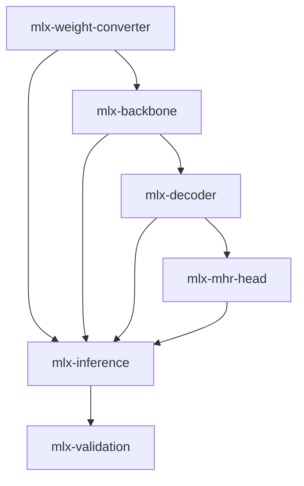

# MLX Port Sub-Manifest — SAM 3D Body

> Parent spec: sam3d-inference | Priority: quality | Created: 2026-04-03
> This replaces the PyTorch inference path with native MLX on Apple Silicon.

## Goal

Port SAM 3D Body from PyTorch to MLX. Full model (backbone + decoder + MHR head), optional TurboQuant KV cache for decoder attention, numerical parity with PyTorch, zero PyTorch in model forward pass (person detection remains external).

## Dependency DAG

## Phase / Sprint / Spec Map

| Phase | Sprint | Spec | Depends On | Status |
|-------|--------|------|------------|--------|
| 1 | 1 | mlx-weight-converter | — | done |
| 1 | 2 | mlx-backbone | mlx-weight-converter | done |
| 2 | 1 | mlx-decoder | mlx-backbone | done |
| 2 | 2 | mlx-mhr-head | mlx-decoder | done |
| 3 | 1 | mlx-inference | all above | done |
| 3 | 1 | mlx-validation | mlx-inference | done |

## Key References

- SAM 3.1 MLX port (blueprint): `/tmp/mlx-vlm/mlx_vlm/models/sam3_1/`
- SAM 3 MLX ViT backbone: `/tmp/mlx-vlm/mlx_vlm/models/sam3/vision.py`
- SAM 3.1 weight converter: `/tmp/mlx-vlm/mlx_vlm/models/sam3_1/convert_weights.py`
- TurboQuant: `/tmp/mlx-vlm/mlx_vlm/turboquant.py`
- DINOv3 PyTorch: `~/.cache/torch/hub/facebookresearch_dinov3_main/dinov3/`
- SAM 3D Body PyTorch: `/tmp/sam-3d-body/sam_3d_body/`
- Weights: `/tmp/sam3d-weights/model.ckpt` + `assets/mhr_model.pt`

## Architecture Mapping (PyTorch → MLX)

| PyTorch Component | MLX Equivalent | Reference |
|-------------------|---------------|-----------|
| `nn.Linear` | `mlx.nn.Linear` | direct |
| `nn.LayerNorm` | `mlx.nn.LayerNorm` | direct |
| `LayerNorm` (bf16) | `mlx.nn.LayerNorm` (eps=1e-5) | direct (NOT RMSNorm) |
| `nn.Conv2d` (NCHW) | `mlx.nn.Conv2d` (NHWC) | transpose weights |
| `nn.ConvTranspose2d` | `mlx.nn.ConvTranspose2d` | transpose weights |
| `F.scaled_dot_product_attention` | `mx.fast.scaled_dot_product_attention` | direct |
| `SwiGLUFFN` | custom `SwiGLU` module | gate * up pattern |
| `LayerScale` | learnable scale param | simple multiply |
| `RopePositionEmbedding` | precomputed cos/sin | see SAM 3 pattern |
| `torch.jit.load` (MHR) | pure MLX FK + skinning | biggest rewrite |
| KV cache | Standard (default) or `TurboQuantKVCache` (optional) | from mlx-vlm |
| `roma` rotation math | inline in `mhr_utils.py` | 3 functions: rotmat↔euler, quat→rotmat |

## GSTACK REVIEW REPORT

| Review | Trigger | Why | Runs | Status | Findings |
|--------|---------|-----|------|--------|----------|
| CEO Review | `/plan-ceo-review` | Scope & strategy | 0 | — | — |
| Codex Review | `/codex review` | Independent 2nd opinion | 0 | — | — |
| Eng Review | `/plan-eng-review` | Architecture & tests (required) | 1 | CLEAR (PLAN) | 10 issues, 2 critical gaps |
| Design Review | `/plan-design-review` | UI/UX gaps | 0 | — | — |

- **UNRESOLVED:** 0
- **VERDICT:** ENG CLEARED — all 10 issues resolved in specs. 2 critical test gaps (index array verification, depth-batched FK parity) added as test tasks.
